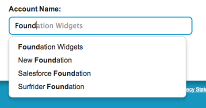

visualforce-typeahead
=====================

A flexible typeahead component for use on Visualforce pages.  Uses the [typeahead.js](http://twitter.github.io/typeahead.js/) library from Twitter.

Use this component to provide a lookup field for related objects, such as the account for a contact.

###Installation
Click here to install: 
https://githubsfdeploy.herokuapp.com/?owner=SalesforceFoundation&repo=visualforce-typeahead

###Video Intro
A 4-minute video showing the basic functionality:  http://youtu.be/Cc87v39Z9tY

###Usage
If you include the component on a Visualforce page in its simplest form, it will search Contacts:
	
	<c:Typeahead />

For other objects, pass in the object parameter:

	<c:Typeahead object="Account" /> 

For an example of the component in use, see the TypeaheadTest page. 

###Component Attributes

There are many attributes you can pass to the component to change its behavior.  For example, the following searches Accounts and puts the ID it finds into a hidden field you can access in your controller.

	<h3>Account Name:</h3>
	<c:Typeahead object="Account" destinationForSelectedId="accountId" />	
	<apex:hidden id="accountId" value="{!accountId}" />		

This table lists the attributes:

Attribute  | Type | Description | Default
---------- | ---- | ----------- | -------
searchBoxId | String | Id attribute for the search input box. | searchBox
styleClass | String | CSS class attribute to apply on the search input box.
style | String | CSS style attribute to apply on the search input box.
placeholder | String | Text to display as a placeholder in the search input box. | Search
object | String | The type of record we are searching. | Contact
objectIdField | String | The field that provides the object Id. | Id
primaryField | String | The field that provides the primary display value. | Name
secondaryField | String | A field to differentiate the display value. Appears in parens.
minSearchLength | Integer | How many characters you must type before searching.  Must be 2 or more. | 2
searchScope | String | Indicates which types of fields on the object to search. One of ALL, NAME, EMAIL, PHONE, SIDEBAR. | ALL
filterClause | String | WHERE clause to filter records. Do not include WHERE.
orderBy | String | Name of field to sort records by. | Name
recordLimit | String | Maximum number of records to return to the list. | 2000
destinationForSelectedId | String | Id of a field, such as an apex:inputHidden, that should get Salesforce Id of the selected item.
destinationForSelectedValue | String | Id of a field, such as an apex:inputHidden, that should get the displayed name/value of the selected item.
stealFocus | Boolean | Whether to automatically move the focus to the search box when the component is displayed. | true

###Possible Improvements
* pass in a function to call when something is selected (so they don't have to click a button)
* specify where to put errors (and then use an alert if not specified)
* specify when to show secondary field (all the time or only when needed to make name unique)
* attribute to pass in HTML suggestion template, or function to render the template
* list of extra fields to query (especially if needed for suggestion template)
* option to use SOQL instead of SOSL - less flexible but faster and possibly more reliable

###License
This project is released for your page-designing pleasure by the [Salesforce Foundation](http://salesforcefoundation.org) Business Applications Team under the open-source [BSD license](http://www.opensource.org/licenses/BSD-3-Clause). Contributors to the project are welcome.

